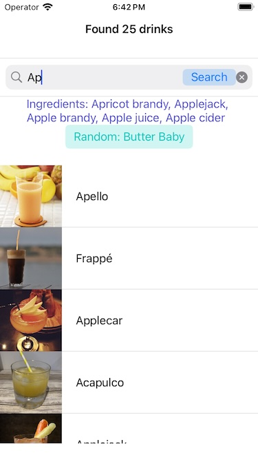

# Drinks DB 🥤🍹  

**DrinksDB** is a simple service client application that allows users to search for a variety of drink recipes by name or ingredient. The app features a modern, responsive user interface with a powerful search bar.  

My goal was to create a simple app that demonstrates the **MVP architecture** concept for better code composition and modularity. Feel free to use it for learning purposes!  

## Features  

- **Modern Architecture**: Demonstrates the **MVP+C architecture** for clean and modular code.  
- **Unit Tests**: Core classes are covered by unit tests, showcasing how screen logic can be verified using mocked data.  
- **DrinksDB API Integration**: Fetch up-to-date drink recipes from the **CocktailDB API**.  
- **Ingredient-Based Search**: Find drinks by searching for specific ingredients.  
- **Code Separation**: Clearly structured code with distinct layers (Service, Repository, etc.).  
- **Dependency Injection**: Presenters are initialized with dependency injection for better testability.  

## App Preview  

  
*Main screen with the search functionality*  

## Installation  

No additional dependencies are required to run the project.  

### Prerequisites  

If you plan to use the **CocktailDB API**, visit the official documentation:  
- [CocktailDB API](https://www.thecocktaildb.com/)  

## Technologies Used  

- **UIKit**: Provides the UI components for the app.  
- **URLSession**: Handles network requests to fetch data from the API.  
- **Codable**: Used for decoding JSON responses.  

## License  

This project is open-source and available under the [MIT License](LICENSE).  
